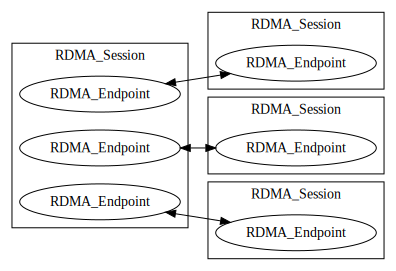

# ~~A Simple RDMA based communication framework~~

A Simple RDMA Wheel.

It should be easy to be put into other Applications.

---



---

Refering from many good implementations & Thanks to their work.

For exp. [TensorFlow's Verbs design](https://github.com/tensorflow/tensorflow/tree/master/tensorflow/contrib/verbs)

---

## Usage

```bash
$ git clone https://github.com/jcf94/RDMA-wheel.git
$ cd RDMA-wheel
$ git submodule init
$ git submodule update
```

Start to test.

---

## Test Performance

in 56 Gb/s FDR

```bash
# ib_read_bw -a
 #bytes     #iterations    BW peak[MB/sec]    BW average[MB/sec]   MsgRate[Mpps]
 2          1000             11.41              9.68               5.075865
 4          1000             26.61              21.28              5.578527
 8          1000             49.30              39.92              5.232950
 16         1000             105.06             82.41              5.400687
 32         1000             189.61             155.34             5.090028
 64         1000             375.88             295.41             4.839923
 128        1000             813.81             717.20             5.875304
 256        1000             1432.20            1429.41            5.854844
 512        1000             2362.67            2222.30            4.551278
 1024       1000             3742.35            3628.16            3.715238
 2048       1000             4577.68            4484.11            2.295864
 4096       1000             4839.62            4771.90            1.221607
 8192       1000             4885.78            4884.95            0.625273
 16384      1000             5084.87            5084.28            0.325394
 32768      1000             5056.70            5056.41            0.161805
 65536      1000             5123.35            5123.23            0.081972
 131072     1000             5126.49            5120.12            0.040961
 262144     1000             5106.72            5102.63            0.020411
 524288     1000             5125.84            5125.83            0.010252
 1048576    1000             5127.01            5126.95            0.005127
 2097152    1000             5125.85            5124.31            0.002562
 4194304    1000             5129.49            5129.48            0.001282
 8388608    1000             4663.16            4658.64            0.000582
```

[Commit 18bc926](https://github.com/jcf94/RDMA-wheel/commit/18bc926205931f4ddd43b763c703273d7b2ff22e):

|Total Bytes|Block Size|Bandwidth|
|-|-|-|
|256 MB|4 KB|40 MB/s|
|512 MB|256 KB|2400 MB/s|
|512 MB|1 MB|3700 MB/s|

Perform Really low bw ...

Continue to be improved ...

[Commit 669a51c](https://github.com/jcf94/RDMA-wheel/commit/669a51ccbdaf28b2ee38319cceb241e986d464c2):

|Total Bytes|Block Size|Bandwidth|
|-|-|-|
|256 MB|4 KB|62 MB/s|
|512 MB|256 KB|2160 MB/s|
|512 MB|1 MB|2031 MB/s|

Bad ...

The memorypool is protected by std::mutex, maybe this can be improved.